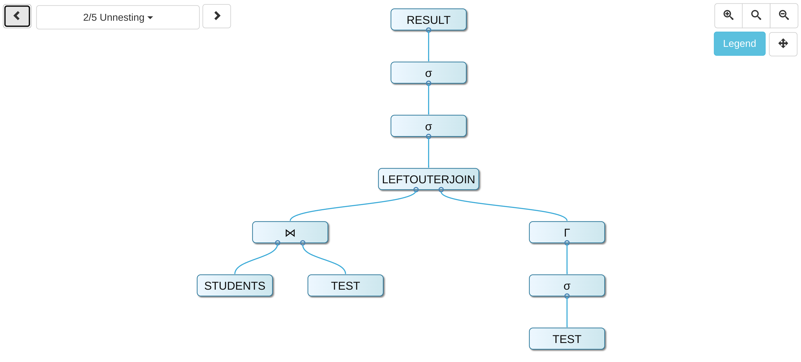

*Note*: all examples from this document can be reproduced in a `psql` or `mzsql` client with [the SQL environment defined in the appendix](#a-sql-environment).

## Correlated Selections

```sql
-- Q1 (KN2015)
SELECT 
  s.name,
  t.lecturenr
FROM
  students s,
  test t
WHERE
  s.studnr = t.studnr AND
  t.grade = (
    SELECT
      min(t2.grade)
    FROM
      test t2
    WHERE
      s.studnr = t2.studnr
  )
```




```sql
-- Q1a - as Q1, but 
-- 1. the correlated query is in the SELECT clause, AND
-- 2. the outer relation consist only of students and not students ⨝ test
SELECT 
  s.name,
  (
    SELECT
      min(t2.grade)
    FROM
      test t2
    WHERE
      s.studnr = t2.studnr
  ) as min_grade
FROM
  students s
```

```sql
-- Q1b - as Q1, but 
-- 1. the subquery is EXISTS and not SELECT, AND
-- 2. the outer relation consists only of students and not students ⨝ test
SELECT 
  s.name
FROM
  students s
WHERE
  EXISTS (
    SELECT
      t.grade
    FROM
      test t
    WHERE
      s.studnr = t.studnr
  )
```

```sql
-- Q1c - the mirror image of Q1b
SELECT
  * 
FROM
  test t
WHERE
  EXISTS (
    SELECT
      *
    FROM
      students s
    WHERE
      s.studnr = t.studnr
  )
```

Inspect plans:

```bash

```

## Appendix

### SQL Environment

An environment identical to [the `hyper-db` "Uni Schema" (English)](https://hyper-db.de/uniEngl.png).

```sql
-- database
DROP DATABASE IF EXISTS decorrelation;
CREATE DATABASE decorrelation;
\c uni;
-- schema
CREATE TABLE STUDENTS(studnr INT NOT NULL, name TEXT NOT NULL, semester smallint);
CREATE TABLE PROFESSORS(persnr INT NOT NULL, name TEXT NOT NULL, level CHAR(2) NOT NULL, room INT);
CREATE TABLE LECTURES(lecturenr INT NOT NULL, title TEXT NOT NULL, weeklyhours SMALLINT NOT NULL, given_by INT);
CREATE TABLE ASSISTANTS(persnr INT NOT NULL, name TEXT NOT NULL, area TEXT NOT NULL, boss INT);
CREATE TABLE REQUIRE(predecessor INT NOT NULL, successor INT NOT NULL);
CREATE TABLE TEST(studnr INT NOT NULL, lecturenr INT NOT NULL, persnr INT NOT NULL,	grade DECIMAL(1, 1));
CREATE TABLE ATTEND(studnr INT NOT NULL, lecturenr INT NOT NULL);
-- data
INSERT INTO STUDENTS VALUES
  (24002, 'Xenokrates', 18),
  (25403, 'Jonas', 12),
  (26120, 'Fichte', 10),
  (26830, 'Aristoxenos', 8),
  (27550, 'Schopenhauer', 6),
  (28106, 'Carnap', 3),
  (29120, 'Theophrastos', 2),
  (29555, 'Feuerbach', 2);
INSERT INTO PROFESSORS VALUES 
  (2125, 'Sokrates', 'C4', 226),
  (2126, 'Russel', 'C4', 232),
  (2127, 'Kopernikus', 'C3', 310),
  (2133, 'Popper', 'C3', 52),
  (2134, 'Augustinus', 'C3', 309),
  (2136, 'Curie', 'C4', 36),
  (2137, 'Kant', 'C4', 7);
INSERT INTO LECTURES VALUES
  (5001, 'Grundzüge', 4, 2137),
  (5041, 'Ethik', 4, 2125),
  (5043, 'Erkenntnistheorie', 3, 2126),
  (5049, 'Mäeutik', 2, 2125),
  (4052, 'Logik', 4, 2125),
  (5052, 'Wissenschaftstheorie', 3, 2126),
  (5216, 'Bioethik', 2, 2126),
  (5259, 'Der Wiener Kreis', 2, 2133),
  (5022, 'Glaube und Wissen', 2, 2134),
  (4630, 'Die 3 Kritiken', 4, 2137);
INSERT INTO ASSISTANTS VALUES
  (3002, 'Platon', 'Ideenlehre', 2125),
  (3003, 'Aristoteles', 'Syllogistik', 2125),
  (3004, 'Wittgenstein', 'Sprachtheorie', 2126),
  (3005, 'Rhetikus', 'Planetenbewegung', 2127),
  (3006, 'Newton', 'Keplersche Gesetze', 2127),
  (3007, 'Spinoza', 'Gott und Natur', 2134);
INSERT INTO REQUIRE VALUES
  (5001, 5041),
  (5001, 5043),
  (5001, 5049),
  (5041, 5216),
  (5043, 5052),
  (5041, 5052),
  (5052, 5259);
INSERT INTO TEST VALUES
  (28106, 5001, 2126, 1.0),
  (25403, 5041, 2125, 2.0),
  (27550, 4630, 2137, 2.0);
INSERT INTO ATTEND VALUES
  (26120, 5001),
  (27550, 5001),
  (27550, 4052),
  (28106, 5041),
  (28106, 5052),
  (28106, 5216),
  (28106, 5259),
  (29120, 5001),
  (29120, 5041),
  (29120, 5049),
  (29555, 5022),
  (25403, 5022),
  (29555, 5001);
```


