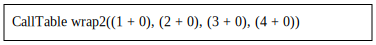
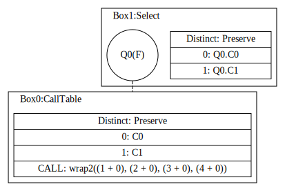
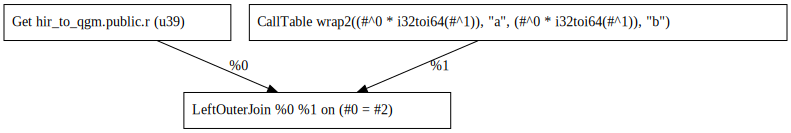
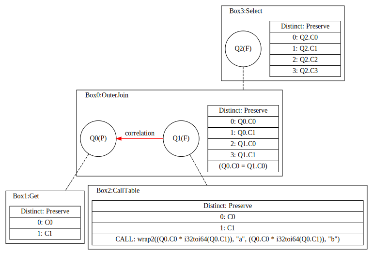
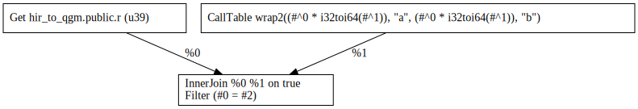
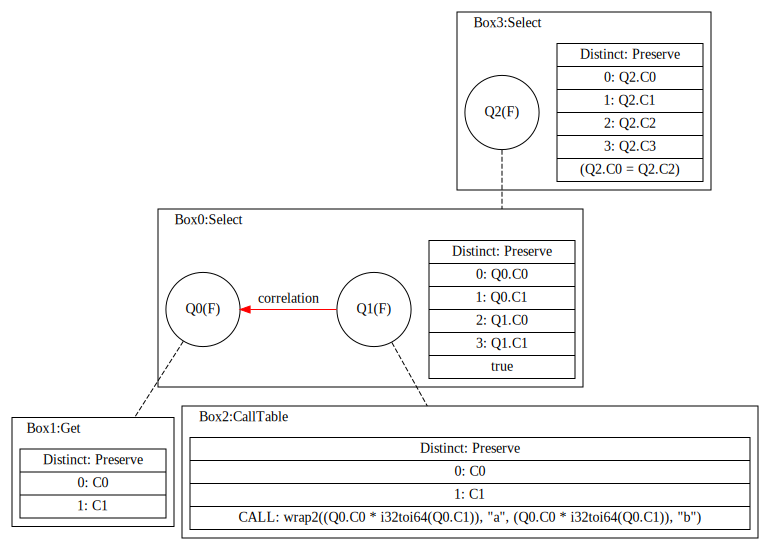
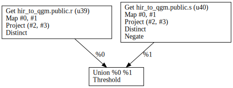
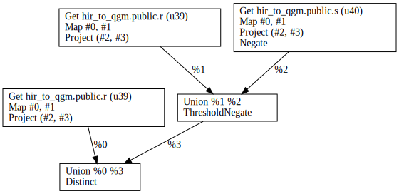
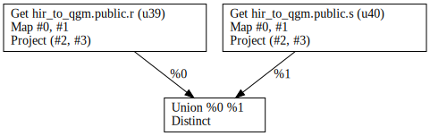
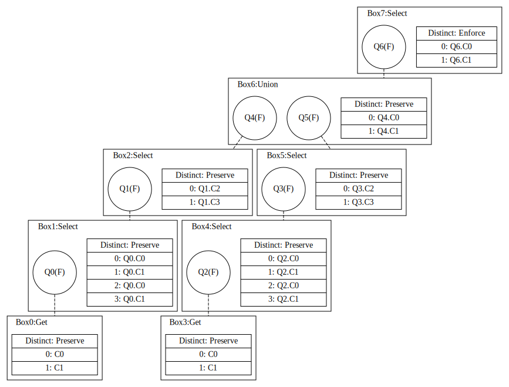

## Appendix A: Schema

```sql
DROP DATABASE IF EXISTS hir_to_qgm;
CREATE DATABASE hir_to_qgm;
\c hir_to_qgm;
CREATE TABLE R (x BIGINT, y INTEGER);
CREATE TABLE S (x BIGINT, y INTEGER);
INSERT INTO R VALUES (0, 0), (1, 1), (2, 2);
INSERT INTO S VALUES (1, 1), (2, 2), (3, 3);
```

## Appendix B: Queries

### CallTable

`CallTable` can occur on its own with uncorrelated exprs.

```sql
-- Q01
SELECT
  *
FROM
  (VALUES (1 + 0, 2 + 0), (3 + 0, 4 + 0)) AS R(a,b)
```

<table style="text-align: center">
  <tbody>
  <tr>
    <td></td>
    <td></td>
  </tr>
  </tbody>
</table>

`CallTable` can occur on the right hand-side of lateral joins, where `exprs` might be correlated to elements bound by the left-hand side.

```sql
-- Q02
SELECT
  *
FROM
  R LEFT OUTER JOIN LATERAL (VALUES (x * y, 'a'), (x * y, 'b')) AS S(u, v) 
ON x = u
```

<table style="text-align: center">
  <tbody>
  <tr>
    <td></td>
    <td></td>
  </tr>
  </tbody>
</table>

```sql
-- Q03
SELECT
  *
FROM
  R,
  LATERAL (VALUES (x * y, 'a'), (x * y, 'b')) AS S(u, v) 
WHERE
  x = u
```

<table style="text-align: center">
  <tbody>
  <tr>
    <td></td>
    <td></td>
  </tr>
  </tbody>
</table>

### `Threshold` and `Negate`

`Threshold` and `Negate` can appear only on HIR subtrees created in the process of planning [`Except`](https://github.com/MaterializeInc/materialize/blob/cf089a6f87dfefc707abe53caad68209c8ed4173/src/sql/src/plan/query.rs#L1148-L1157) and [`Intersect`](https://github.com/MaterializeInc/materialize/blob/cf089a6f87dfefc707abe53caad68209c8ed4173/src/sql/src/plan/query.rs#L1158-L1172) nodes.


```sql
-- Q04
SELECT
  *
FROM
  (SELECT * FROM R)
  EXCEPT
  (SELECT * FROM S)
```

<table style="text-align: center">
  <tbody>
  <tr>
    <td></td>
    <!-- <td></td> -->
  </tr>
  </tbody>
</table>

```sql
-- Q05
SELECT
  *
FROM
  (SELECT * FROM R)
  INTERSECT
  (SELECT * FROM S)
```

<table style="text-align: center">
  <tbody>
  <tr>
    <td></td>
    <!-- <td></td> -->
  </tr>
  </tbody>
</table>

We need to either adapt `HIR` or pattern match on the expressions created during HIR planning.

### `Union`

`Union` should be straight-forward to implement.


```sql
-- Q06
SELECT
  *
FROM
  (SELECT * FROM R)
  UNION
  (SELECT * FROM S)
```

<table style="text-align: center">
  <tbody>
  <tr>
    <td></td>
    <td></td>
  </tr>
  </tbody>
</table>

### `TopK`

[`TopK`](https://github.com/MaterializeInc/materialize/blob/f234d3a33f98859f3caa1890d6062f6e4e4e8594/src/sql/src/plan/expr.rs#L100-L112) "groups and orders within each group, limiting output", so it will be converted to a `Select` box with an optional preceding `Grouping` box.

### `DeclareKeys`

As far as I can tell, `DeclareKeys` is not used at the moment and can be treated as a noop.