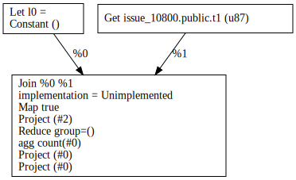
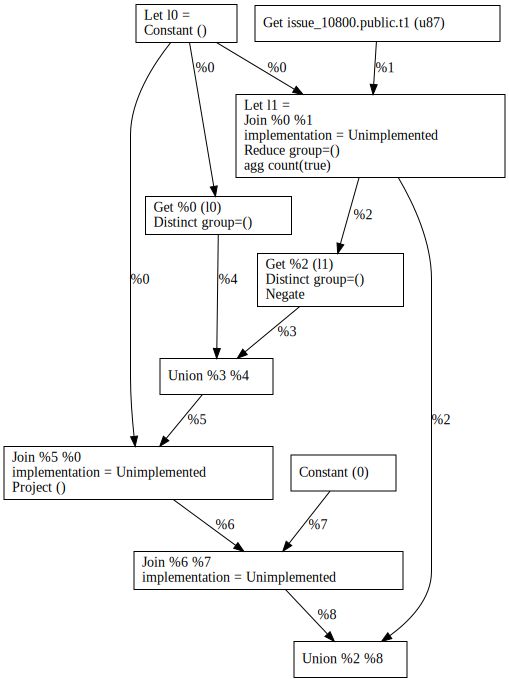
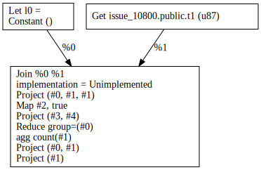
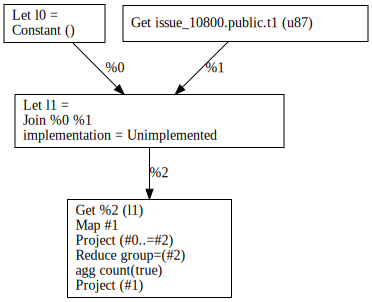
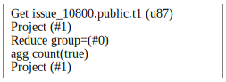

## Queries

```sql
-- Q1
SELECT
  COUNT(*)
FROM
  t1

-- Q2
SELECT
  COUNT(*)
FROM
  t1
GROUP BY
  f2
```

At first glance the problem is that for `Q1` the QGM path does not generate the SQL-specific machinery for handling empty aggregates when lowering global aggregates to MIR.

<table style="text-align: center;">
  <thead>
  <tr>
    <td>Decorrelated Plan (+QGM)</td>
    <td>Decorrelated Plan (-QGM)</td>
  </tr>
  </thead>
  <tbody>
  <tr>
    <td></td>
    <td></td>
  </tr>
  </tbody>
</table>

For `Q2` (an aggregate with a key), the two decorrelated plans differ, but the optimized pans are identical.


<table style="text-align: center;">
  <thead>
  <tr>
    <td>Decorrelated Plan (+QGM)</td>
    <td>Decorrelated Plan (-QGM)</td>
  </tr>
  </thead>
  <tbody>
  <tr>
    <td></td>
    <td></td>
  </tr>
  </tbody>
  <thead>
  <tr>
    <td>Optimized Plan (+QGM)</td>
    <td>Optimized Plan (-QGM)</td>
  </tr>
  </thead>
  <tbody>
  <tr>
    <td></td>
    <td></td>
  </tr>
  </tbody>
</table>

## Appendix: DB Schema

```sql
-- database
CREATE DATABASE issue_10800;
-- schema
CREATE TABLE t1 (f1 int, f2 int);
```