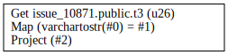
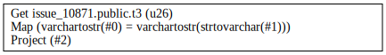
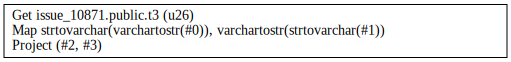
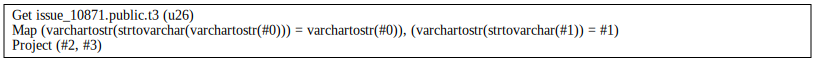
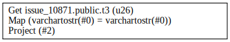

## Observations

- The SQL type system is [documented here](https://materialize.com/docs/sql/types/).
- The SQL type system is [defined in `repr::scalar::ScalarType`](https://github.com/MaterializeInc/materialize/blob/4501e0d5ef95376f98b43781df2d0a0a2c40d529/src/repr/src/scalar.rs#L851-L956).
- Data types are [represented using types defined in `repr::scalar::Datum`](https://github.com/MaterializeInc/materialize/blob/4501e0d5ef95376f98b43781df2d0a0a2c40d529/src/repr/src/scalar.rs#L39-L110). Note that the relationship between `ScalarType` and `Datum` variants (types) is M:N.
- [Operator implementations for `=` are defined here](https://github.com/MaterializeInc/materialize/blob/74d4dc11ef174860e32a47c6ac66b16d29b5ff49/src/sql/src/func.rs#L3249-L3271).

It looks like in the join-semilattice of SQL types `varchar(n) ∧ string = string`, so a comparison `lhs = rhs` where `lhs: varchar(n)` and `rhs: string` is always transformed to `varchartostr(lhs) = rhs`. As an example, see [Q01](#q01) (which is identical to the manually defined [Q03](#q03)), [Q05](#q05), and [Q06](#q06).

Interestingly, the upcast happens also when both sides are `varchar` ([Q06](#q06)). My current assumption is that this happens because the `varchar(n)` family of types does not implement the SQL equality operator. Consequently, the use of `varchar(n)` values on the `lhs` or `rhs` of `lhs = rhs` will trigger an upcast to the least type that embeds `varchar(n)` without duplicates and implements SQL equality (see [this slack thread](https://materializeinc.slack.com/archives/CMHDK0DK8/p1646833864100109) for discussion). Note that `ScalarType::VarChar` is encoded as `Datum::String`.

## Appendix A: Schema

```sql
DROP DATABASE IF EXISTS issue_10871;
CREATE DATABASE issue_10871;
\c issue_10871;

-- CREATE TABLE t1 (f1 BIGINT, f2 INTEGER);
-- CREATE TABLE t2 (f1 BIGINT, f2 INTEGER);
CREATE TABLE t3 (f1 VARCHAR, f2 TEXT);

-- INSERT INTO t1 VALUES (0, 0), (1, 1), (2, 2);
-- INSERT INTO t2 VALUES (1, 1), (2, 2), (3, 3);
INSERT INTO t3 VALUES ('a', 'Alice'), ('b', 'Bob'), ('c', 'Charles');

-- CREATE INDEX t1i1 ON t1(f1);
-- CREATE INDEX t1i2 ON t1(f2, f1);
-- CREATE INDEX t2i1 ON t2(f1);
-- CREATE INDEX i2i2 ON t2(f2, f1);
```

## Appendix B: Queries

### Q01

```sql
-- Q01
SELECT
  f1 = f2
FROM
  t3
```



### Q02


```sql
-- Q02
SELECT
  f1 = f2::varchar
FROM
  t3
```



### Q03

```sql
-- Q03
SELECT
  f1::string = f2
FROM
  t3
```


### Q4

```sql
-- Q4
SELECT
  f1::string::varchar,
  f2::varchar::string
FROM
  t3
```



### Q05

```sql
-- Q05
SELECT
  f1::string::varchar = f1,
  f2::varchar::string = f2
FROM
  t3
```



### Q06

```sql
-- Q06
SELECT
  f1 = f1
FROM
  t3
```

