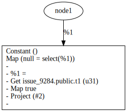
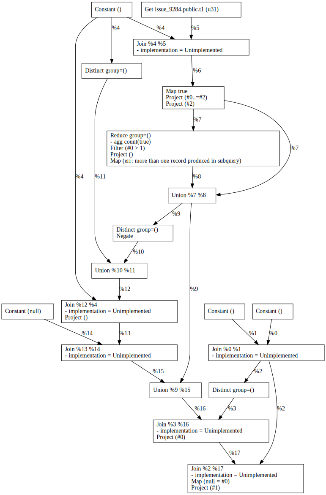
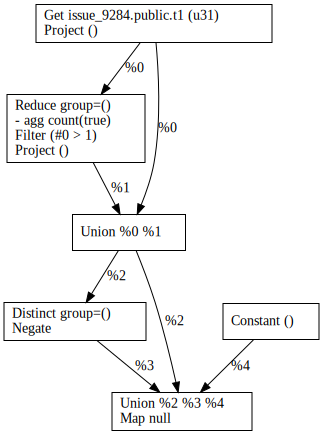

## Appendix A: Schema

```sql
DROP DATABASE IF EXISTS issue_9284;
CREATE DATABASE issue_9284;
\c issue_9284;
CREATE TABLE t1 (f1 BIGINT, f2 INTEGER);
INSERT INTO t1 VALUES (0, 0), (1, 1), (2, 2);
```

## Appendix B: Queries

### Q01

```sql
-- Q01
SELECT NULL = (SELECT TRUE FROM t1)
```

<table style="text-align: center";>
  <tbody>
  <tr>
    <td></td>
    <td></td>
    <td></td>
  </tr>
  </tbody>
</table>
