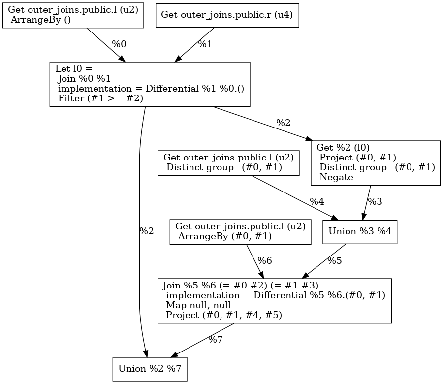

## State of the Art

At the moment, the optimized plan of the for the following query:

```sql
SELECT
    L.x, L.y, R.y, R.z
FROM
    L LEFT OUTER JOIN R ON L.y = R.y
```

renders as follows:


The general pattern is as follows:

1. Compute the inner join `X1` of the two input relations `L` and `R` on the join predicate `(a_1, .., a_n) = (b_1, .., b_n)`.
1. Compute the duplicate eliminating projection of `a_1, .., a_n` in `X1`.
1. Join `L` with the above result on `a_1, .., a_n`.
1. Compute the difference of the above with `X1` to find out all elements of `R` that don't have a match in `X1`.
1. Extend the above difference with nulls to match the schema of `X1`.
1. Compute union of `X1` and the above.

In pseudo-code, this corresponds to:

```rust
let p = |(l, r)| (l.a_1, .., l.a_n) == (r.a_1, .., r.a_n);
let X1 = inner_join(L, R).on(p);
let X2 = X1.map(|i| (i.a_1, .., i.a_n).();
let X3 = inner_join(L, X2).on(p);
let X4 = difference(L, X3);
let X5 = X4.map(|r| (r, null, .., null));
let X6 = union(X1, X5)
X6
```

In Differential Dataflow (DD), we need to arrange:

1. `L` on `a_1, .., a_n`.
2. `R` on `b_1, .., b_n`.
2. `X1` on `a_1, .., a_n`.

For a full outer join, steps (2)-(5) need to be duplicated with reverse roles, and the final result is the union of X1 with X5 and its symmetric clone. This is very close to the relational algebra definition of outer join given in the Wikipedia article[^wiki-loj].

## Proposal

I propose to replace steps (2)-(4) with an `antijoin` operator[^wiki-aj] which is already present in DD[^dd-aj].

In pseudo-code, this corresponds to:

```rust
let p = |(l, r)| (l.a_1, .., l.a_n) == (r.a_1, .., r.a_n);
let X1 = inner_join(L, R).on(p);
let X2 = L.antijoin(R).on(p);
let X3 = X2.map(|r| (r, null, .., null));
let X6 = union(X1, X3)
X6
```

This has the benefit that we don't need the arrangement on `X1`.

## Limitations

The propsal works only for outer joins with equality predicate. Joins with non-equality predicates, such as

```sql
SELECT
    L.x, L.y, R.y, R.z
FROM
    L LEFT OUTER JOIN R ON L.y >= R.y
```

will need to use the old plan.



## Correlated Subqueries

```sql
SELECT
     L.x, L.y, R.y, R.z
 FROM
     L FULL OUTER JOIN R ON L.y = R.y AND EXISTS(SELECT * FROM T where T.a < R.z);
```

## Appendix: DB Schema

```sql
-- database
CREATE DATABASE outer_joins;
-- schema
CREATE TABLE L(x INT NOT NULL, y INT NOT NULL);
CREATE TABLE R(y INT NOT NULL, z INT NOT NULL);
CREATE TABLE T(a INT NOT NULL);
-- data
INSERT INTO L VALUES (1, 2), (2, 3);
INSERT INTO R VALUES (1, 2), (2, 3);
INSERT INTO T VALUES (2);
```

[^wiki-loj]: [Relational algebra: Right outer join (⟖)](https://en.wikipedia.org/wiki/Relational_algebra#Left_outer_join_(%E2%9F%95))
[^wiki-aj]: [Relational algebra: Antijoin (▷)](https://en.wikipedia.org/wiki/Relational_algebra#Antijoin_(%E2%96%B7))
[^dd-aj]: [`differential_dataflow::operators::join::Join::antijoin`](https://docs.rs/differential-dataflow/latest/differential_dataflow/operators/join/trait.Join.html#tymethod.antijoin)