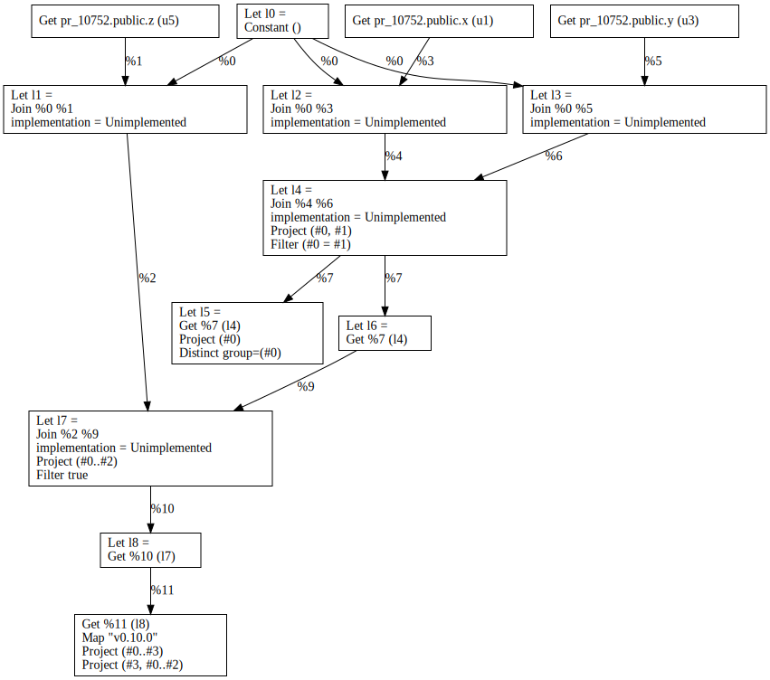
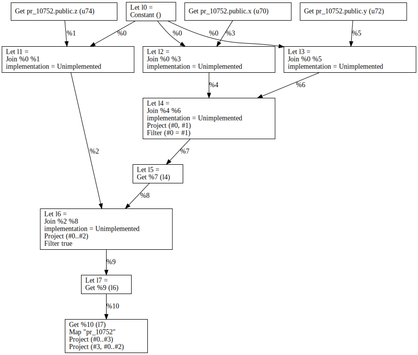

## Queries

### v0.19.0

```sql
SELECT 'v0.10.0', *
FROM z, LATERAL(SELECT * FROM x INNER JOIN y ON x.a = y.a);
```



### PR Branch

```sql
SELECT 'pr_10752', *
FROM z, LATERAL(SELECT * FROM x INNER JOIN y ON x.a = y.a);
```



## Appendix: DB Schema

```sql
-- database
CREATE DATABASE pr_10752;
-- schema
CREATE TABLE x (a int);
CREATE TABLE y (a int);
CREATE TABLE z (a int);
-- data
INSERT INTO x VALUES (1), (2), (3);
INSERT INTO y VALUES (2), (3), (4);
INSERT INTO y VALUES (0);
```