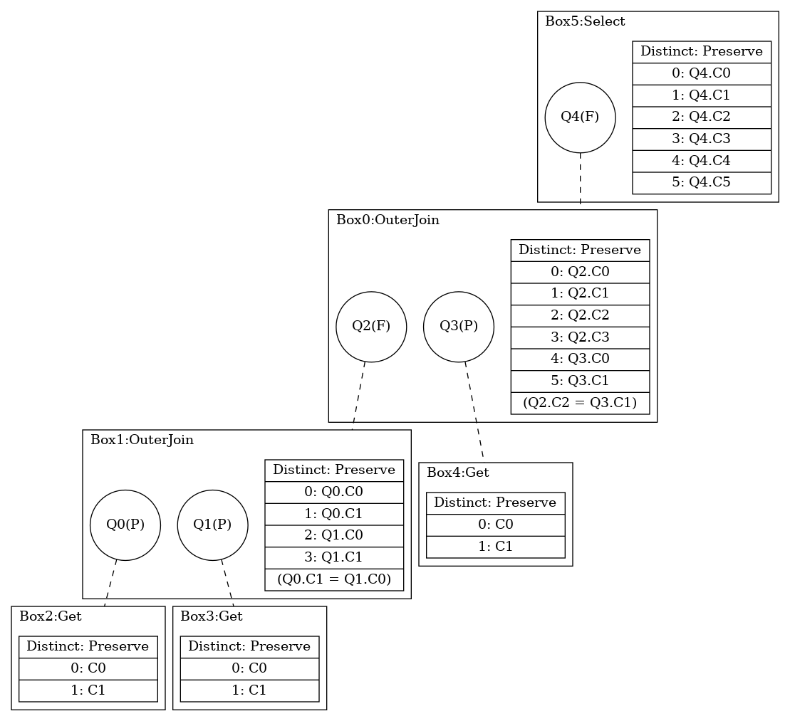
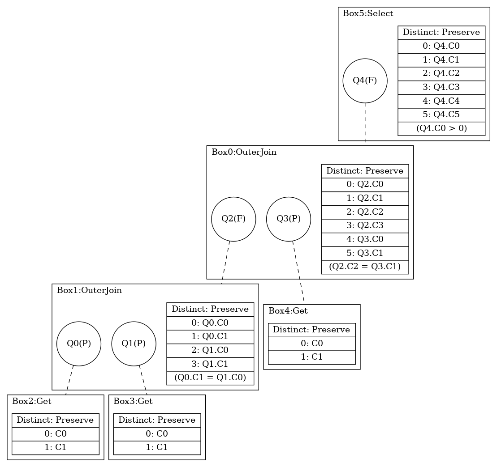

## Environment

```sql
-- database
CREATE DATABASE rej_nulls;
-- schema
CREATE TABLE R(x INT NOT NULL, y INT NOT NULL);
CREATE TABLE S(y INT NOT NULL, z INT NOT NULL);
CREATE TABLE T(x INT, y INT);
CREATE TABLE U(x INT, y INT NOT NULL);
-- data
INSERT INTO R VALUES (1, 2), (2, 3);
INSERT INTO S VALUES (1, 2), (2, 3);
INSERT INTO T VALUES (1, 2), (2, 3);
INSERT INTO U VALUES (1, 2), (2, 3);
```

## Queries & Plans

### Q1

```sql
SELECT
    R.x, R.y, S.y, S.z, T.x, T.y
FROM
    R 
    FULL OUTER JOIN S ON R.y = S.y 
    RIGHT OUTER JOIN T ON S.y = T.y
```



- The FULL OUTER JOIN between R and S (Box1 in the QGM) can be simplified to a RIGHT OUTER JOIN due to the fact that the S.y = T.y join predicate of the following RIGHT OUTER JOIN will reject nulls on S.y. 

### Q2

```sql
SELECT
    R.x, R.y, S.y, S.z, T.x, T.y
FROM
    R 
    FULL OUTER JOIN S ON R.y = S.y 
    RIGHT OUTER JOIN T ON S.y = T.y
WHERE
    R.x > 0
```



- The FULL OUTER JOIN between R and S (Box1 in the QGM) can be simplified to a RIGHT OUTER JOIN due to the fact that the S.y = T.y join predicate of the following RIGHT OUTER JOIN will reject nulls on S.y.
- The FULL OUTER JOIN between R and S (Box1 in the QGM) can be simplified to a LEFT OUTER JOIN due to the fact that the R.x > 0 join predicate will reject nulls on R.x.
- The cumulative effect a simplification of the join between R and S to an INNER JOIN.

## References
