## [Item No 3](https://github.com/MaterializeInc/materialize/pull/10679#issuecomment-1046683220)

> [...] some relatively degenerate queries could not be folded all the way to Constant whereas a non-QGM execution would do that:

### Schema

```sql
CREATE TABLE t1 (f1 DOUBLE PRECISION, f2 DOUBLE PRECISION NOT NULL);
CREATE TABLE t2 (f1 DOUBLE PRECISION, f2 DOUBLE PRECISION NOT NULL);

CREATE INDEX t1i1 ON t1(f1);
CREATE INDEX t1i2 ON t1(f2, f1);
CREATE INDEX t2i1 ON t2(f1);
CREATE INDEX i2i2 ON t2(f2, f1);
```

### Query

```sql
SELECT
  *
FROM
  t1 a1
  LEFT JOIN t1 a2 ON TRUE AND a1.f1 = a2.f1
  LEFT JOIN t2 ON TRUE
WHERE
  a1.f1 = a2.f1 AND
  a2.f2 = a1.f1 AND
  a2.f1 = a1.f2 AND
  a2.f1 < a1.f2 AND
  a2.f2 = 5
```

This looks like a yet another case of where the MIR `NonNullRequirements` transform does not function 100% correctly.
Here are the decorrelated and optimized plans with and without QGM:

<table style="text-align: center";>
  <tbody>
  <tr>
    <td>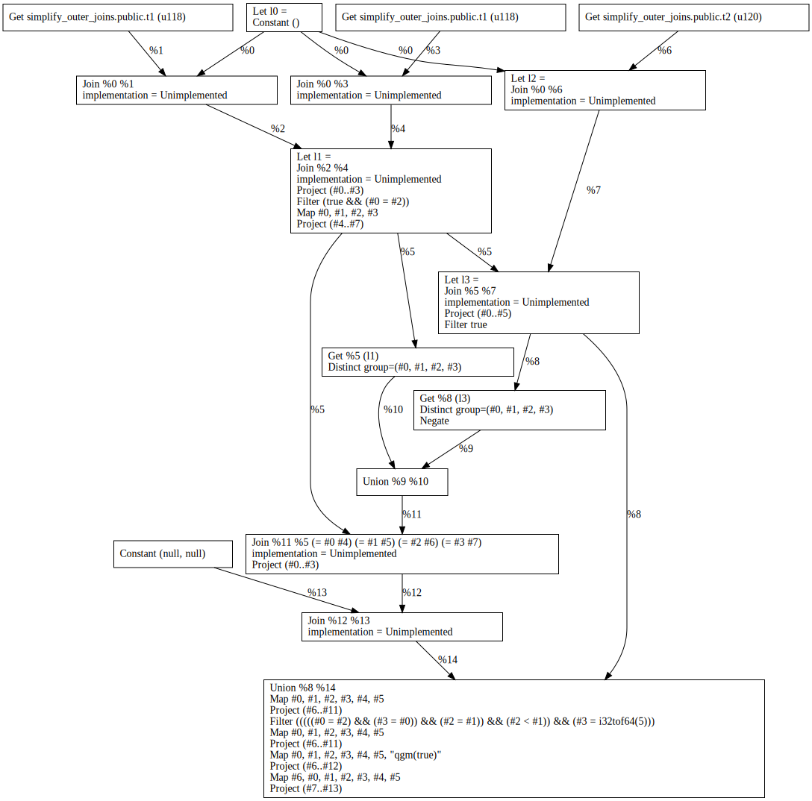</td>
    <td>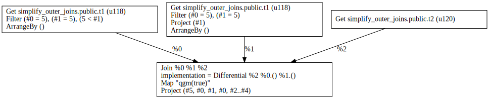</td>
  </tr>
  <tr>
    <td>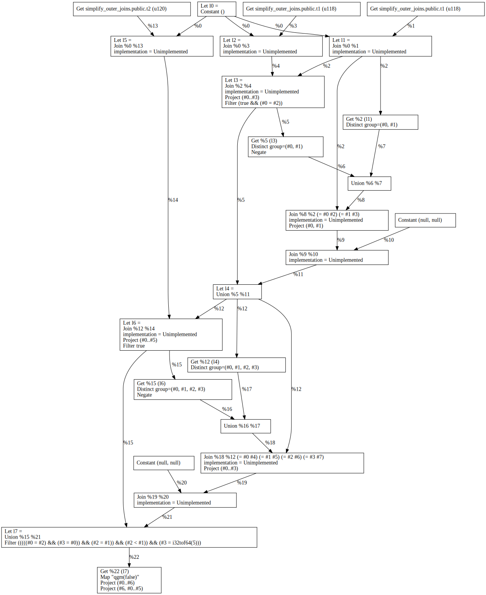</td>
    <td>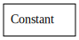</td>
  </tr>
  </tbody>
</table>

Observe that although the QGM variant of the decorrelated plan is simpler, the optimized plan in the non-QGM case reduces to `Constant`, while the QGM one does not.

## [Item No 5](https://github.com/MaterializeInc/materialize/pull/10679#issuecomment-1046731280)

> For this slightly degenerate query, the QGM approach fails to push into both sides of the join:

### Schema

In [SCHEMA_TPCH.sql](../SCHEMA_TPCH.sql).

```bash
psql -d tpch -U "$MZT_DB_USER" -h "$MZT_DB_HOST" -p "$MZT_DB_PORT" -f "$MZT_REPOSITORY/../SCHEMA_TPCH.sql"
```

### Query

```sql
-- Q5
SELECT
  *
FROM
  orders 
  FULL OUTER JOIN customer ON ( c_acctbal = o_totalprice )
WHERE
  c_acctbal + o_totalprice = 123 AND
  c_acctbal = o_totalprice
```

This can be simplified to the following query

```sql
-- Q5'
SELECT
  *
FROM
  orders 
  INNER JOIN customer ON ( c_acctbal = o_totalprice )
WHERE
  c_acctbal + o_totalprice = 123 AND
  c_acctbal = o_totalprice
```

and a variant of that query where the `c_acctbal = o_totalprice` appears only once. 

```sql
SELECT
  *
FROM
  orders, 
  customer
WHERE
  c_acctbal + o_totalprice = 123 AND
  c_acctbal = o_totalprice
```

Here are the decorrelated and optimized plans for `Q5` (with and without QGM ) and for `Q5'` and `Q5''` (without QGM):

<table style="text-align: center";>
  <tbody>
  <tr>
    <td>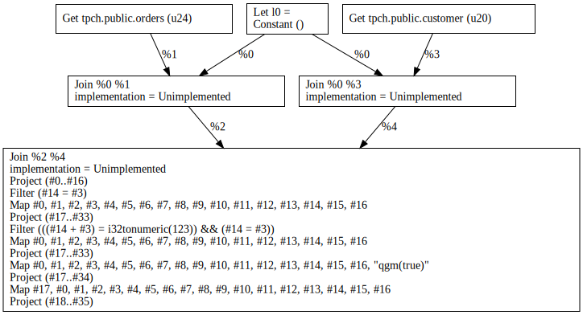</td>
    <td>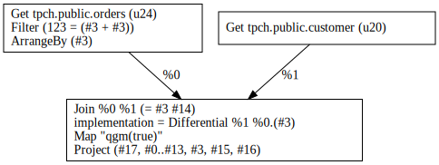</td>
  </tr>
  <tr>
    <td>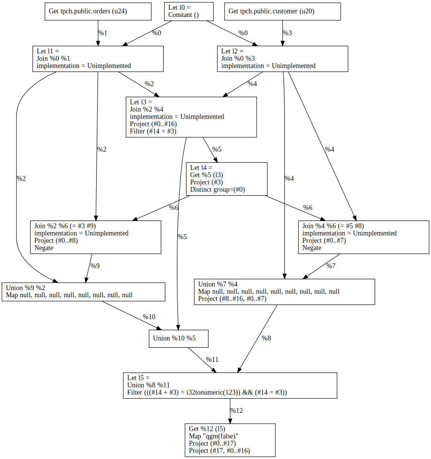</td>
    <td>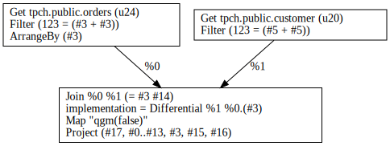</td>
  </tr>
  <tr>
    <td>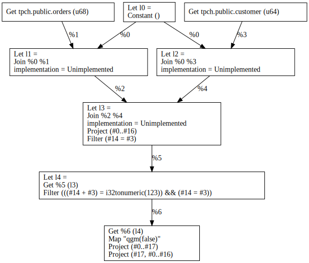</td>
    <td>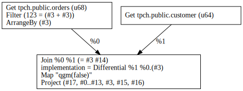</td>
  </tr>
  <tr>
    <td></td>
    <td></td>
  </tr>
  </tbody>
</table>

Initially, I was thinking that item was caused by the fact that in the `QGM ⇒ MIR` lowering code, [the box columns are lowered as a `Map` node](https://github.com/MaterializeInc/materialize/blob/4e0e662e84a33cf76a4a3bd4734c93c048a93206/src/sql/src/query_model/mir.rs#L126-L135).
In some cases, the column expressions are simple enough to represent them as `Project` nodes.
However, even after rewriting the lowering code to directly generate `Project` nodes, the issue still exists, as evidenced by the fact that the problem can be seen in the QGM path of `Q5` as well as the (non QGM) path of `Q5'` and `Q5''`.

## [Item No 6](https://github.com/MaterializeInc/materialize/pull/10679#issuecomment-1046840035)

> With QGM, there is a an extra `Project`, which seems to be doing nothing in this particular case:

### Schema

```sql
CREATE TABLE table_f4_f5 (f4 integer, f5 integer);
CREATE TABLE table_f5_f6 (f5 integer, f6 integer);
```

### Query

```sql
SELECT
  *
FROM
  table_f4_f5
  RIGHT JOIN table_f5_f6 USING (f5)
WHERE
  TRUE AND
  f5 = f4
```

This looks like a yet another case of where the MIR `NonNullRequirements` transform does not function 100% correctly.
Here are the decorrelated and optimized plans with and without QGM:

<table style="text-align: center";>
  <tbody>
  <tr>
    <td>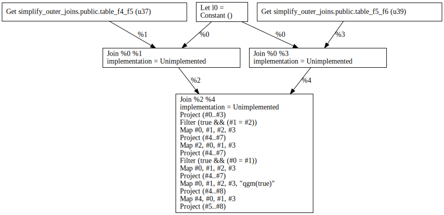</td>
    <td>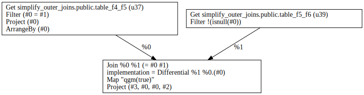</td>
  </tr>
  <tr>
    <td>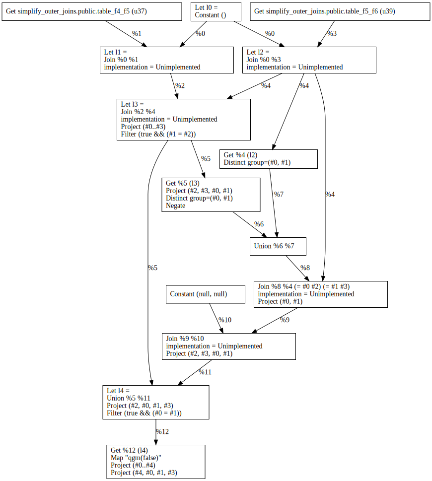</td>
    <td>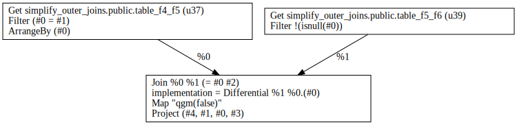</td>
  </tr>
  </tbody>
</table>

Most probably due to phase ordering, the non-QGM case cannot figure out that the left input can be made narrower before the join.

## [Item No 7](https://github.com/MaterializeInc/materialize/pull/10679#issuecomment-1046846004)

> [...] in a USING situation, QGM elects to take the values from the column from one of the participating tables wheres non-QGM takes the same column from the other table that has it:

### Schema

```sql
CREATE TABLE table_f1_f2_f3 (f1 integer, f2 integer, f3 integer);
CREATE TABLE table_f3_f4_f5 (f3 integer, f4 integer, f5 integer);
CREATE TABLE table_f5_f6 (f5 integer, f6 integer);
```

### Query

```sql
SELECT
  *
FROM
  table_f1_f2_f3
  LEFT JOIN (table_f3_f4_f5 RIGHT JOIN table_f5_f6 USING (f5)) USING (f3)
WHERE
  TRUE AND
  f5 = 0
```

I have no idea what is happening here but it doesn't seem to harmful.
Here are the decorrelated and optimized plans with and without QGM:

<table style="text-align: center";>
  <tbody>
  <tr>
    <td>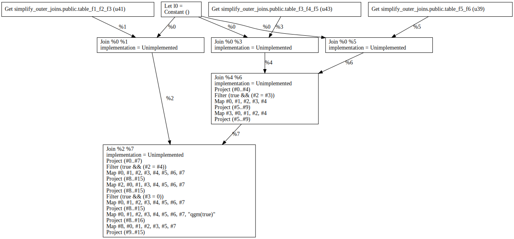</td>
    <td>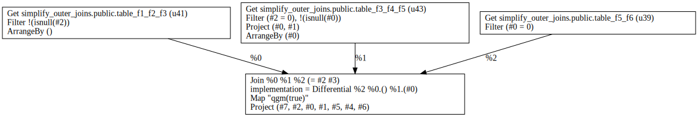</td>
  </tr>
  <tr>
    <td>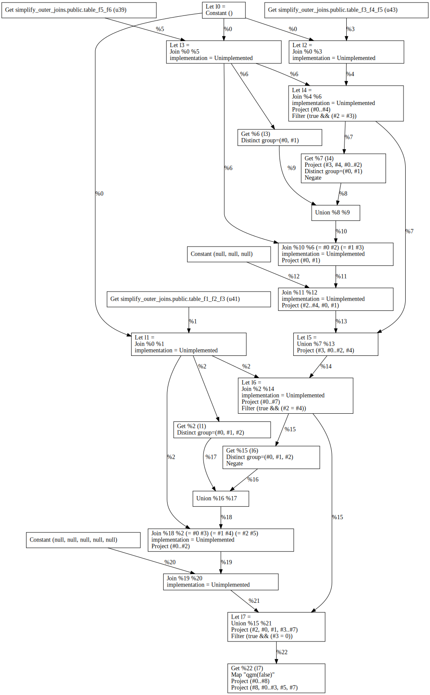</td>
    <td>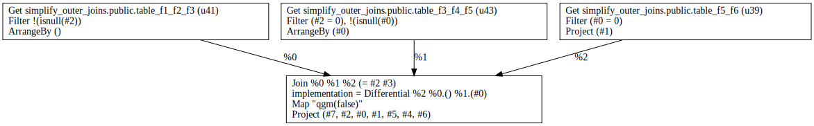</td>
  </tr>
  </tbody>
</table>
