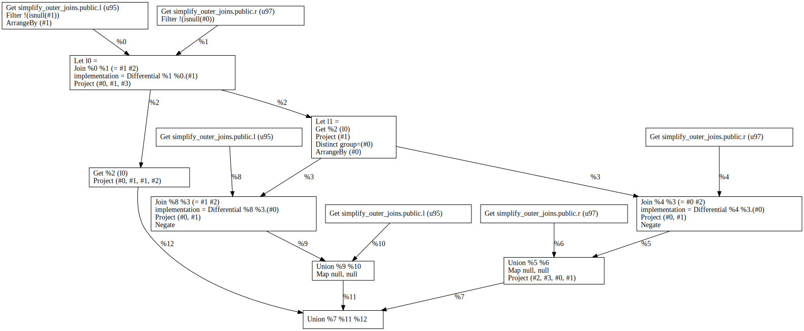
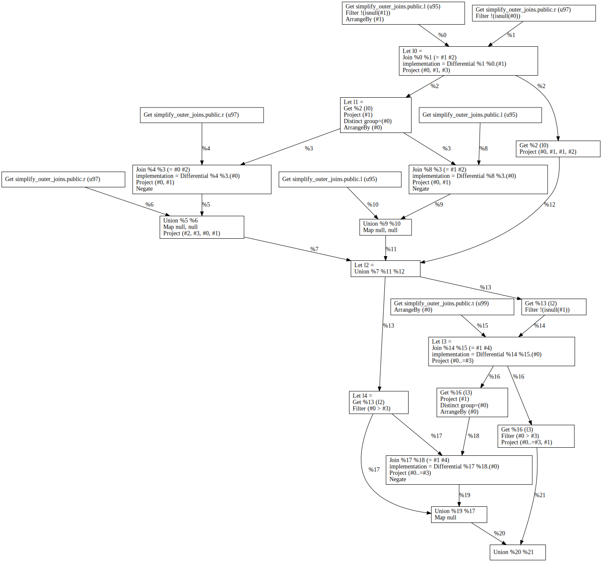

*Note*: all examples from this document can be reproduced in a `psql` or `mzsql` client with [the SQL environment defined in the appendix](#a-sql-environment).
## Recap

The <em>inner join</em> between two tables (relations) is the subset of the ordered pairs (cross product) of those tables that satisfies a certain predicate <em>p</em>.
The following `INNER JOIN` query

```sql
-- Q1
SELECT
  L.x, L.y, R.y, R.z
FROM
  L INNER JOIN R ON L.y = R.y
```

can be represented as a selection (highlighted **like this**) of elements from the cross product between the two tables (represented as a table with rows corresponding to `L`-records and columns to `R`-records).

<table>
  <tbody>
    <tr>
      <td>
        (l<sub>1</sub>,r<sub>1</sub>)
      </td>
      <td>
        (l<sub>1</sub>,r<sub>2</sub>)
      </td>
      <td>
        (l<sub>1</sub>,r<sub>3</sub>)
      </td>
    </tr>
    <tr>
      <td>
        (l<sub>2</sub>,r<sub>1</sub>)
      </td>
      <td>
        (l<sub>2</sub/>,r<sub>2</sub>)
      </td>
      <td>
        <strong>(l<sub>2</sub/>,r<sub>3</sub>)</strong>
      </td>
    </tr>
    <tr>
      <td>
        (l<sub>3</sub>,r<sub>1</sub>)
      </td>
      <td>
        (l<sub>3</sub/>,r<sub>2</sub>)
      </td>
      <td>
        (l<sub>3</sub/>,r<sub>3</sub>)
      </td>
    </tr>
  </tbody>
</table>

The <em>left</em>, <em>right</em>, or <em>full outer join</em> extend the inner join by preserving the rows from the corresponding side that don't have an inner join partner, padding elements from the opposite side with `NULL` values.
The `FULL OUTER JOIN` variant of the `INNER JOIN` query from above

```sql
-- Q2
SELECT
  L.x, L.y, R.y, R.z
FROM
  L FULL OUTER JOIN R ON L.y = R.y
```

can be visually represented as follows (result elements are highlighted <strong>like this</strong>).

<table>
  <tbody>
    <tr>
      <td>
      </td>
      <td>
        <table>
          <tbody>
            <tr>
              <td>
                <strong>(_,r<sub>1</sub>)</strong>
              </td>
              <td>
                <strong>(_,r<sub>2</sub>)</strong>
              </td>
              <td>
                (_,r<sub>3</sub>)
              </td>
            </tr>
          </tbody>
        </table>
      </td>
    </tr>
    <tr>
      <td>
        <table>
          <tbody>
            <tr>
              <td>
                <strong>(l<sub>1</sub>,_)</strong>
              </td>
            </tr>
            <tr>
              <td>
                (l<sub>2</sub>,_)
              </td>
            </tr>
            <tr>
              <td>
                <strong>(l<sub>3</sub>,_)</strong>
              </td>
            </tr>
          </tbody>
        </table>
      </td>
      <td>
        <table>
          <tbody>
            <tr>
              <td>
                (l<sub>1</sub>,r<sub>1</sub>)
              </td>
              <td>
                (l<sub>1</sub>,r<sub>2</sub>)
              </td>
              <td>
                (l<sub>1</sub>,r<sub>3</sub>)
              </td>
            </tr>
            <tr>
              <td>
                (l<sub>2</sub>,r<sub>1</sub>)
              </td>
              <td>
                (l<sub>2</sub/>,r<sub>2</sub>)
              </td>
              <td>
                <strong>(l<sub>2</sub/>,r<sub>3</sub>)</strong>
              </td>
            </tr>
            <tr>
              <td>
                (l<sub>3</sub>,r<sub>1</sub>)
              </td>
              <td>
                (l<sub>3</sub/>,r<sub>2</sub>)
              </td>
              <td>
                (l<sub>3</sub/>,r<sub>3</sub>)
              </td>
            </tr>
          </tbody>
        </table>
      </td>
    </tr>
  </tbody>
</table>

## MIR representation

In MIR (the dataflow-oriented intermediate representation used by Materialize), joins are expanded to a subgraph that:

1. computes the inner join, 
2. branches out to compute the left and right outer parts, and finally
3. builds the union of the inner join with the two branch results.

The `FULL OUTER JOIN` query from above results in the following MIR graph.



## Outer join simplification

In some cases, predicates applied after the join reject the outer parts[^lr1997].
The `FULL OUTER JOIN` queries

```sql
-- Q3
SELECT
  L.x, L.y, R.y, R.z
FROM
  L FULL OUTER JOIN R ON L.y = R.y
WHERE
  L.x < 42;

-- Q4
SELECT
  L.x, L.y, R.y, R.z
FROM
  L FULL OUTER JOIN R ON L.y = R.y
WHERE
  L.x < R.z;
```
therefore produce the same result as 
```sql
-- Q3'
SELECT
  L.x, L.y, R.y, R.z
FROM
  L LEFT OUTER JOIN R ON L.y = R.y
WHERE
  L.x < 42;

-- Q4'
SELECT
  L.x, L.y, R.y, R.z
FROM
  L INNER JOIN R ON L.y = R.y
WHERE
  L.x < R.z;
```

### Outer join simplification as an MIR optimization

We already have optimizations in place that eliminate the corresponding branches altogether in order to save unnecessary work and resource utilization.
This moves the burdon from the customer, who otherwise needs to spot and apply these optimizations manually at the SQL level.
For example, the optimized MIR plan for `Q4` is identical with the one for `Q4'`.


### Limitations in MIR

Due to the fact that we eliminate outer joins *after* lowering outer joins to a dataflow-oriented graph, the resulting branching structure in MIR prevents us from generalizing the optimization for chains (and more generally, trees) of outer joins followed by a null-rejecting predicate.
This is evidenced by the following query

```sql
-- Q5
SELECT
  L.x, L.y, R.y, R.z, T.a
FROM
  L FULL OUTER JOIN R ON L.y = R.y
    LEFT OUTER JOIN T ON L.y = T.a
WHERE
  L.x > R.z;
```

where the resulting optimized plan still contains two `FULL OUTER JOIN` subgraphs, even though the predicate in the `WHERE` clause is enough to simplify the first one to an `INNER JOIN`.



Unfortunately, this pattern has alerady been seein multiple times in customer issues [product/issues/135](https://github.com/MaterializeInc/product/issues/135), [materialize/issues/6987](https://github.com/MaterializeInc/materialize/issues/6987).

## Outer Join Simplification in QGM

As discussed in the previous all-hands update, the query optimizer decided to gradually introduce Query Graph Model (QGM) in the codebase.
QGM is a SQL-oriented intermediate representation that facilitates faster and more maintainable implementation of SQL-specific optimizations.

We have spent the better part of the last two months laying the foundation for an optimizer built on top of MIR and implementing outer join simplifications as a first rewrite on top of that foundation (see the tracking issue [#10232](https://github.com/MaterializeInc/materialize/issues/10232) for details).

The QGM-based optimization path can be optionally enabled by a feature flag:

```sql
SET qgm_optimizations_experimental = true
```

and is already able to produce the desired result for `Q5`:

<table>
  <thead>
  <tr>
    <td></td>
    <td></td>
  </tr>
  </thead>
</table>


## Appendix
### SQL Environment

```sql
-- database
DROP DATABASE IF EXISTS simplify_outer_joins;
CREATE DATABASE simplify_outer_joins;
\c simplify_outer_joins;
-- schema
CREATE TABLE L(x INT, y INT);
CREATE TABLE R(y INT, z INT NOT NULL);
CREATE TABLE T(a INT);
-- data
INSERT INTO L VALUES (0, null), (1, 2), (2, 3);
INSERT INTO R VALUES (null, 1), (1, 2), (2, 3);
INSERT INTO T VALUES (2);
```

### Bibliography

[^lr1997]: [Galindo-Legaria, Cesar, and Arnon Rosenthal. "Outerjoin simplification and reordering for query optimization." ACM Transactions on Database Systems (TODS) 22.1 (1997): 43-74.](https://www.academia.edu/26160408/Outerjoin_simplification_and_reordering_for_query_optimization)