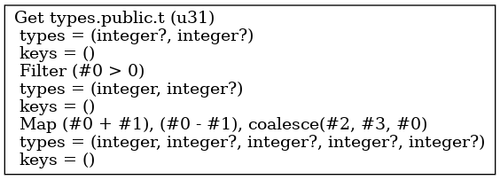
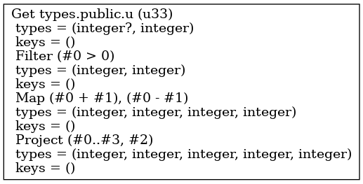

## Environment

```sql
-- database
CREATE DATABASE types;
-- schema
CREATE TABLE R(x INT NOT NULL, y INT NOT NULL);
CREATE TABLE S(y INT NOT NULL, z INT NOT NULL);
CREATE TABLE T(x INT, y INT);
CREATE TABLE U(x INT, y INT NOT NULL);
-- data
INSERT INTO R VALUES (1, 2), (2, 3);
INSERT INTO S VALUES (1, 2), (2, 3);
INSERT INTO T VALUES (1, 2), (2, 3);
INSERT INTO U VALUES (1, 2), (2, 3);
```

## Queries & Plans

### Q1

```sql
SELECT
    x,
    y,
    x + y,
    x - y,
    coalesce(x + y, x - y, x)
FROM
    T
WHERE
    x > 0
```



### Q2

```sql
SELECT
    x,
    y,
    x + y,
    x - y,
    coalesce(x + y, x - y, x)
FROM
    U
WHERE
    x > 0
```



## Observations

The `propagates_nulls()` on the various function types implies the following equivallent statements:

1. If any of the inputs can be null, the output can be null.
1. If all of the inputs cannot be null, the output cannot be null.

--- 

The type of `coalesce(#2, #3, #0)` in [Q1](#q1) is inferred as `integer?` and not as the more precise `integer`.
We know that at least one parameter (`#0`) is not nullable, so it should be possible to infer that `coalesce(#2, #3, #0)` itself is not nullable.
The issue is not observed in [Q2](#q2), where all input arguments are inferred as nullable.

---

The `coalesce` function is marked to return `false` in `VariadicFunc::propagates_nulls`[^var_propagates_nulls], so it is not clear how non-nullability is inferred in [Q2](#q2).

---

There is a function `MirScalarExpr::non_null_requirements`[^mir_non_null_requirements] that is copied in [#9917](https://github.com/MaterializeInc/materialize/pull/9917) as `BoxScalarExpr::non_null_requirements`.

---

`MirScalarExpr::non_null_requirements`[^mir_non_null_requirements] is used in the `NonNullRequirements`[^NonNullRequirements] transform, which has the following snippet in its module description[^NonNullRequirements]:


> These requirements are not here introduced as constraints, but rather flow
> to sources of data and restrict any constant collections to those rows that
> satisfy the constraint. The main consequence is when Null values are added
> in support of outer-joins and subqueries, we can occasionally remove that
> branch when we observe that Null values would be subjected to predicates.

It's interesting to see whether this actually happens for some cases.

---

Another occurence is in `canonicalize_predicates`[^canonicalize_predicates].

---

The most interesting use site for the current investigation seems to be `MirRelationExpr::typ_with_input_types`[^mir_typ_with_input_types].

---

Notes while reading through `MirRelationExpr::typ_with_input_types`[^mir_typ_with_input_types]:

- `RelationType` consists of type information **and** unique keys information.
  - Is it possible to separate the two? 
  - Are they computed independently from each other?
- TODO: abstract over the representation type for unique keys. 
  - Maintaining things stable is an implementation detail.
  - Ideally the representation should not be 2^N.
  - Maybe use the fact that we only need to track minimal keys.
- Case `MirRelationExpr::Constant`:
  - TODO: Multi-column keys are not yet detected.
  - Q1: why is the key of a singleton collection with diff = 1 empty?
- Case `MirRelationExpr::Let`:
  - `input_types.last().unwrap().clone()` for `Let`, because `body` is visited after `value`.
- Case `MirRelationExpr::Project`
  - Q2: which representation is faster for maintaining projections: a list of ints or a bitmap optimized for sparsity?
- Case `MirRelationExpr::Get`:
  - This returns `typ.clone()` for a `typ` field of `Get`. 
  - Q3: what if we figure out to restrict the type of the corresponding `Let` binding in the meantime?
- Case `MirRelationExpr::Map`:
  - Infer remappings of unique inputs and adjust the unique keys.
- Case `MirRelationExpr::Filter`:
  - "A filter inherits the keys of its input unless the filters have reduced the input to a single row, in which case the keys of the input are `()`".
  - Seems like a decision of convention that answers Q1.
  - `cols_equal_to_literal`: are we detecting the `literal = column` case?
  - The critical for typing part is the "Augment non-nullability of columns" section[^augment_non_nullability].
  - This was added by Frank last year in June [^pr7209].
  - An initial version was added by Nikhil shortly before that[^pr7177].


## References

[^bin_propagates_nulls]: [`BinaryFunc::propagates_nulls`](https://github.com/MaterializeInc/materialize/blob/e6d39c5ed796d831635a6c445c30e78eb0e0149f/src/expr/src/scalar/func.rs#L2610)

[^var_propagates_nulls]: [`VariadicFunc::propagates_nulls`](https://github.com/MaterializeInc/materialize/blob/e6d39c5ed796d831635a6c445c30e78eb0e0149f/src/expr/src/scalar/func.rs#L5535)

[^mir_non_null_requirements]: [`MirScalarExpr::non_null_requirements`](https://github.com/MaterializeInc/materialize/blob/7c7573df64d1fd0e15f7b548e41c947cd1ba446a/src/expr/src/scalar/mod.rs#L882)

[^mir_typ_with_input_types]: [`MirRelationExpr::typ_with_input_types`](https://github.com/MaterializeInc/materialize/blob/d720cd0c61c3c108406298f71012ee4bb1c2d1e6/src/expr/src/relation/mod.rs#L516)

[^canonicalize_predicates]: [`canonicalize_predicates`](https://github.com/MaterializeInc/materialize/blob/ceadb6cb458cb4366b43a4fbd1fcc56e4cff1029/src/expr/src/relation/canonicalize.rs#L226)

[^NonNullRequirements]: [`NonNullRequirements`](https://github.com/MaterializeInc/materialize/blob/df22ffc959373b86aa9379c11fc4f80307560346/src/transform/src/nonnull_requirements.rs#L16-L20)

[^augment_non_nullability]: [augment non-nullability of columns in `MirRelationExpr::typ_with_input_types`](https://github.com/MaterializeInc/materialize/blob/7c7573df64d1fd0e15f7b548e41c947cd1ba446a/src/expr/src/relation/mod.rs#L512-L541)

[^pr7209]: [[optimization] nullability in types reflects predicates #7209](https://github.com/MaterializeInc/materialize/pull/7209)

[^pr7177]: [expr: fix nullability deduction of record fields #7177](https://github.com/MaterializeInc/materialize/pull/7177)